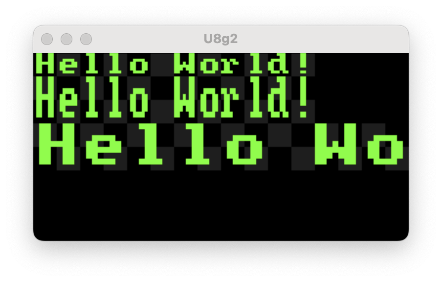

# U8G2 Simulator

SDL-powered desktop harness for experimenting with [U8g2](https://github.com/olikraus/u8g2) drawing commands before deploying to real hardware. Write or port your display code in `main.cpp`, build once, and iterate visually.

## Requirements
- [xmake](https://xmake.io/#/guide/installation) (build orchestrator)

## Get Started
1. Clone the repo and open a shell in its root.
2. Let xmake fetch dependencies and compile the static `u8g2` library plus the SDL shim by running:
   ```bash
   xmake build
   ```
3. Launch the simulator window (default target `U8G2Simulator`):
   ```bash
   xmake run
   ```
4. Interact with the SDL window; press any key to advance through the demo scenes defined in `main.cpp`.

## Workflow Tips
- Modify `main.cpp` to experiment with different fonts, draw calls, or input handling. `xmake run` automatically rebuilds what changed.
- To toggle build type: `xmake f -m debug` or `xmake f -m release` followed by `xmake build`.
- Generated artifacts live under `build/` (xmake default). Clean up with `xmake clean`.

## Project Layout
- `main.cpp` – entry point that initializes the SDL backend and issues U8g2 draw calls.
- `components/u8g2` – vendored U8g2 sources, fonts, and SDL support utilities.
- `xmake.lua` – build description tying everything together.

## Troubleshooting
- **SDL cannot open display**: ensure you are not running headless, or export `SDL_VIDEODRIVER=x11`/`wayland` as needed.
- **Missing libsdl**: verify it is discoverable via your system package manager or install with `xrepo install libsdl` and re-run `xmake build`.
- **Stale configuration**: run `xmake f -c` to clear cached options if you move between toolchains.

Happy hacking!
